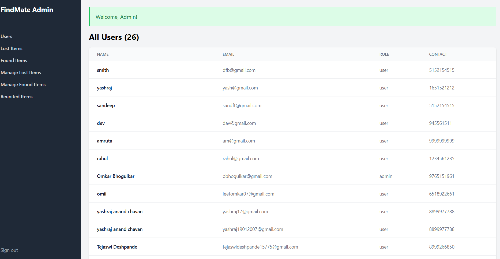
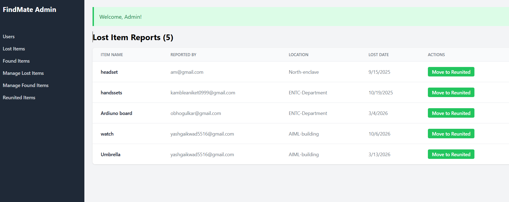
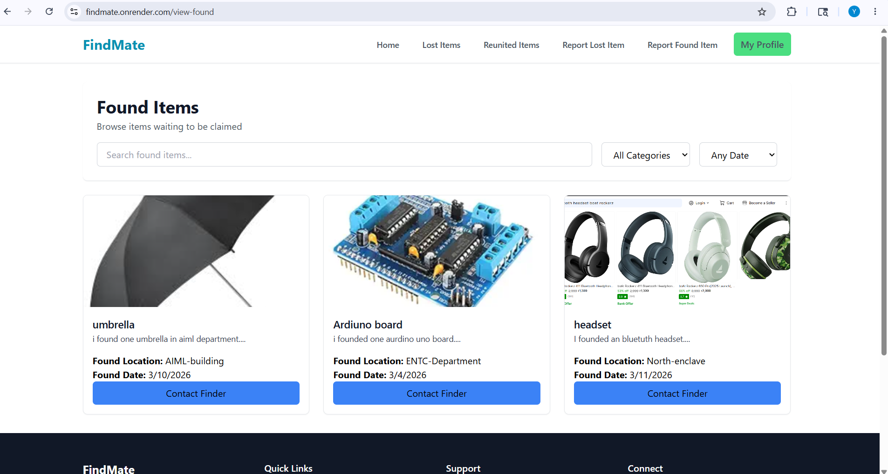
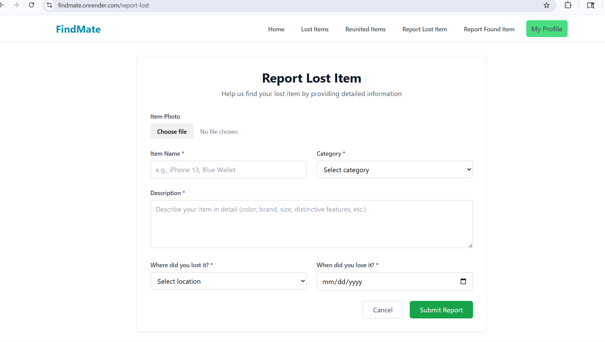
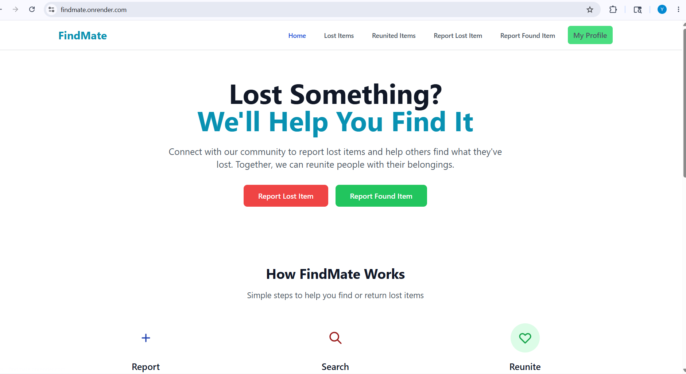

📄 README — Node.js Backend (FindMate-ML-Enhanced)
FindMate - ML-Enhanced Lost & Found System
A full-stack lost and found web application with AI-powered matching built with Node.js, Express, MongoDB, and EJS. Features intelligent item matching using machine learning to automatically connect lost and found items.
🆕 What's New in ML-Enhanced Version
Images : 

1. AI-Powered Matching

Automatic matching between lost and found items
Confidence scoring based on multiple factors
Smart algorithms considering category, description, location, and date

2. Admin ML Dashboard

Review pending ML matches
Side-by-side item comparison
Verify or reject matches
Initiate contact between users

3. Enhanced Item Tracking

Match status tracking for all items
Confidence scores for verified matches
Complete audit trail of admin actions

4. Automated Notifications

Email alerts for high-confidence matches
User contact initiation emails
Admin notification system

🚀 Quick Start
bashcd FindMate-ML-Enhanced
npm install
cp .env.example .env
# Edit .env with your configuration
npm run dev
Access at: http://localhost:3000
📋 Key Features

✅ User authentication with email verification
✅ Report lost items (public)
✅ Report found items (admin-only)
✅ ⭐ AI-powered item matching
✅ ⭐ Admin match review dashboard
✅ Photo uploads via Cloudinary
✅ Email notifications
✅ Mobile-responsive design

🔧 ML Service Status
Currently: ML Service Disabled (ML_ENABLED=false)
The application works perfectly without ML — manual admin matching available, all features functional, no ML service required.
To enable ML matching: deploy ML service → set ML_ENABLED=true → configure ML_SERVICE_URL and ML_SERVICE_API_KEY.
📂 Project Structure
FindMate-ML-Enhanced/
├── models/          # MongoDB schemas (ML-enhanced)
├── services/        # ⭐ ML & notification services
├── routes/          # Express routes + admin ML routes
├── views/           # EJS templates + admin ML views
├── public/          # Static assets
└── config/          # Cloudinary configuration
📊 Tech Stack

Backend: Node.js, Express.js
Database: MongoDB
Auth: Passport.js
Email: Nodemailer
Storage: Cloudinary
Frontend: EJS, Tailwind CSS
ML: Python/Flask (separate service, optional)

🔐 Admin Access

Login: /admin-login
Dashboard: /admin-dashboard
ML Matches: /admin/matches

📧 Environment Variables
Key variables: DATABASE_URL, SESSION_SECRET, CLOUDINARY_*, EMAIL_*, ML_ENABLED, ML_SERVICE_URL
Version: 2.0.0-ML-Enhanced | Status: Production Ready (ML Optional)

📄 README — Python ML Service (FindMate-ML-Service)
FindMate ML Service
AI-powered matching service for lost and found items. Handles all machine learning operations.
🎯 Features
Hybrid Matching Algorithm — category compatibility, TF-IDF description similarity, fuzzy matching, attribute matching (color, brand, model), location proximity with campus aliases, and date proximity with decay function.
📂 Project Structure
FindMate-ML-Service/
├── app.py                  # Main Flask application
├── requirements.txt        # Python dependencies
├── Procfile                # Deployment config
├── middleware/auth.py      # API key authentication
├── services/matcher.py     # Core matching logic
├── services/db_service.py  # MongoDB operations
└── utils/
    ├── text_similarity.py  # TF-IDF matching
    ├── location_matcher.py # Fuzzy location matching
    └── date_scorer.py      # Date proximity calc
🚀 Quick Start
bashpython -m venv venv
source venv/bin/activate
pip install -r requirements.txt
cp .env.example .env
python app.py
Service runs at: http://localhost:5000
📡 API Endpoints
GET /health — Health check
POST /match/lost-to-found — Match a lost item against found items
POST /match/found-to-lost — Match a found item against lost items
Both match endpoints require header X-API-Key: your-api-key and return confidence scores + match factors.
📊 Matching Algorithm Weights
category     × 0.18
description  × 0.28
item_name    × 0.13
attributes   × 0.14
location     × 0.16
date         × 0.11
🔄 Future Enhancements

Image similarity using CNN
Advanced NLP with spaCy
Real-time matching with WebSockets
Model training from admin feedback

Version: 2.0.0 | Status: Production Ready